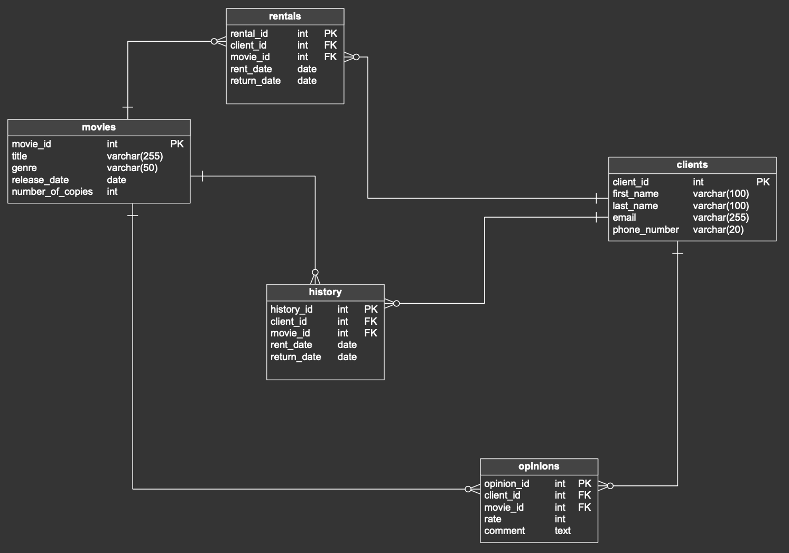
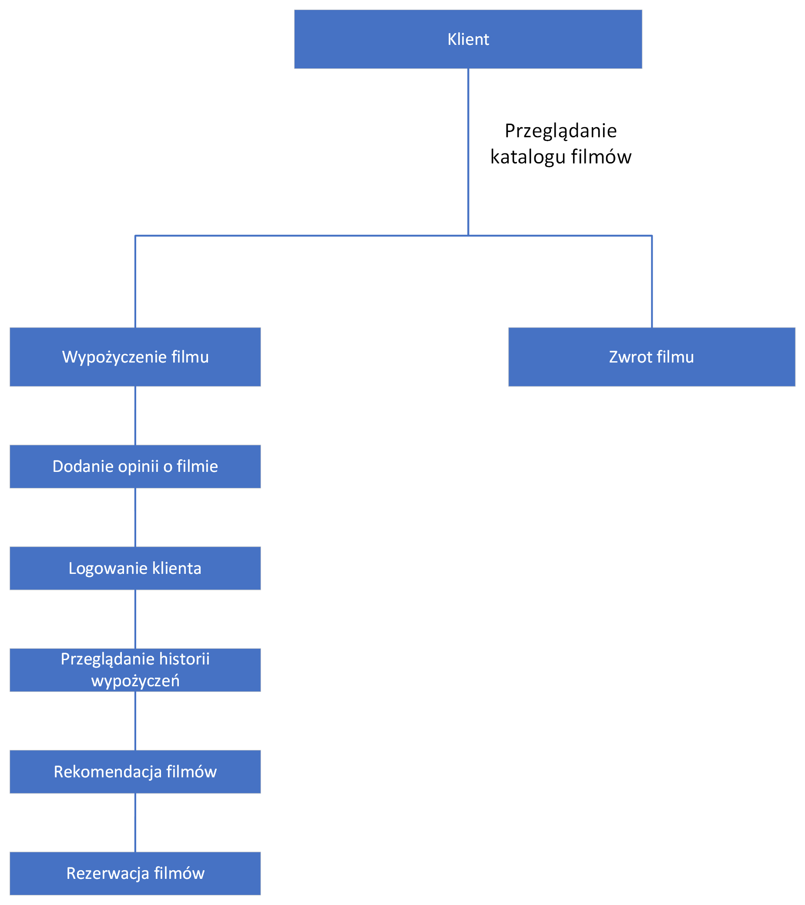
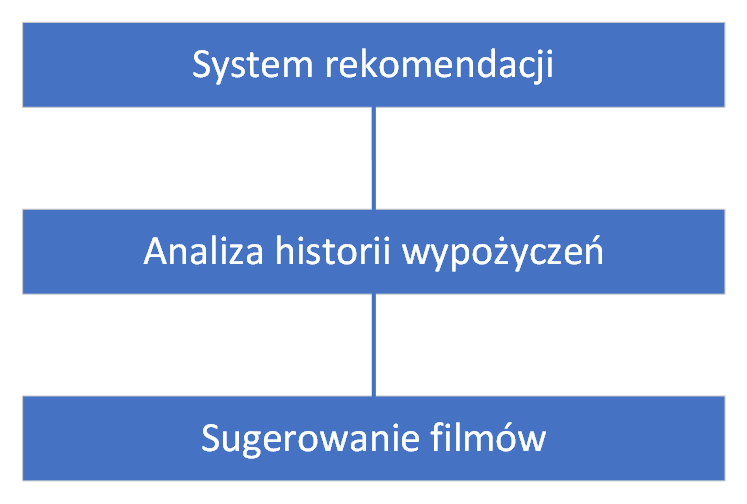

# Baza danych filmów i system rekomendacji
Autor: Michał Romaszewski

Niestety nie mogłem się porozumieć z partnerem wyznaczonym do pracy w grupie (Michał Rojek) więc projekt wykonałem samodzielnie.

### Koncepcja rozwiązania systemu ewidencji wypożyczalni filmów

#### 1. Wprowadzenie
Celem projektu jest stworzenie kompleksowego systemu baz danych, który wspomaga pracę wypożyczalni filmów. System ten będzie zarządzał informacjami o filmach, klientach, wypożyczeniach, opiniach i historii wypożyczeń. Dodatkowo zostanie wprowadzony system rekomendacji filmów na podstawie preferencji użytkowników i ich historii oglądania.

#### 2. Diagram bazy danych


#### 3. Struktura bazy danych
Baza danych będzie składała się z pięciu głównych tabel: Filmy, Klienci, Wypożyczenia, Opinie i Historia. 
Poniżej znajduje się szczegółowy opis każdej z tabel.

##### TABELA: FILMY
-	movie_id (int, PK): Unikalny identyfikator filmu.
-	title (varchar(255)): Tytuł filmu.
-	genre (varchar(50)): Gatunek filmu.
-	release_date (date): Data premiery filmu.
-	number_of_copies (int): Liczba kopii dostępnych w wypożyczalni.

```sql
CREATE TABLE movies (
    movie_id int  NOT NULL,
    title varchar(255)  NOT NULL,
    genre varchar(50)  NOT NULL,
    release_date date  NOT NULL,
    number_of_copies int  NOT NULL,
    CONSTRAINT movies_pk PRIMARY KEY  (movie_id)
);
```

##### TABELA: KLIENCI
-	client_id (int, PK): Unikalny identyfikator klienta.
-	first_name (varchar(100)): Imię klienta.
-	last_name (varchar(100)): Nazwisko klienta.
-	email (varchar(255)): Adres e-mail klienta.
-	phone_number (varchar(20)): Numer telefonu klienta.

```sql
CREATE TABLE clients (
    client_id int  NOT NULL,
    first_name varchar(100)  NOT NULL,
    last_name varchar(100)  NOT NULL,
    email varchar(255)  NOT NULL,
    phone_number varchar(20)  NOT NULL,
    CONSTRAINT clients_pk PRIMARY KEY  (client_id)
);
```

##### TABELA: WYPOŻYCZENIA
-	rental_id (int, PK): Unikalny identyfikator wypożyczenia.
-	client_id (int, FK): Identyfikator klienta (klucz obcy, referencja do tabeli Klienci).
-	movie_id (int, FK): Identyfikator filmu (klucz obcy, referencja do tabeli Filmy).
-	rent_date (date): Data wypożyczenia.
-	return_date (date): Data zwrotu.

```sql
CREATE TABLE rentals (
    rental_id int  NOT NULL,
    client_id int  NOT NULL,
    movie_id int  NOT NULL,
    rent_date date  NOT NULL,
    return_date date  NOT NULL,
    CONSTRAINT rentals_pk PRIMARY KEY  (rental_id)
);
```

```sql
-- Klucze obce
ALTER TABLE rentals ADD CONSTRAINT rentals_clients
    FOREIGN KEY (client_id)
    REFERENCES clients (client_id);

ALTER TABLE rentals ADD CONSTRAINT rentals_movies
    FOREIGN KEY (movie_id)
    REFERENCES movies (movie_id);
```

##### TABELA: HISTORIA
-	history_id (int, PK): Unikalny identyfikator historii.
-	client_id (int, FK): Identyfikator klienta (klucz obcy, referencja do tabeli Klienci).
-	movie_id (int, FK): Identyfikator filmu (klucz obcy, referencja do tabeli Filmy).
-	rent_date (date): Data wypożyczenia.
-	return_date (date): Data zwrotu.

```sql
CREATE TABLE history (
    history_id int  NOT NULL,
    client_id int  NOT NULL,
    movie_id int  NOT NULL,
    rent_date date  NOT NULL,
    return_date date  NOT NULL,
    CONSTRAINT history_pk PRIMARY KEY  (history_id)
);
```

```sql
-- Klucze obce
ALTER TABLE history ADD CONSTRAINT history_clients
    FOREIGN KEY (client_id)
    REFERENCES clients (client_id);

ALTER TABLE history ADD CONSTRAINT history_movies
    FOREIGN KEY (movie_id)
    REFERENCES movies (movie_id);
```

##### TABELA: OPINIE
-	opinion_id (int, PK): Unikalny identyfikator opinii.
-	client_id (int, FK): Identyfikator klienta (klucz obcy, referencja do tabeli Klienci).
-	movie_id (int, FK): Identyfikator filmu (klucz obcy, referencja do tabeli Filmy).
-	rate (int): Ocena filmu (np. w skali od 1 do 10).
-	comment (text): Komentarz użytkownika dotyczący filmu.

```sql
CREATE TABLE opinions (
    opinion_id int  NOT NULL,
    client_id int  NOT NULL,
    movie_id int  NOT NULL,
    rate int  NOT NULL,
    comment text  NOT NULL,
    CONSTRAINT opinions_pk PRIMARY KEY  (opinion_id)
);
```

```sql
-- Klucze obce
ALTER TABLE opinions ADD CONSTRAINT opinions_clients
    FOREIGN KEY (client_id)
    REFERENCES clients (client_id);

ALTER TABLE opinions ADD CONSTRAINT opinions_movies
    FOREIGN KEY (movie_id)
    REFERENCES movies (movie_id);
```

#### 4. RELACJE MIĘDZY TABELAMI
-	Filmy i Klienci mają relacje z tabelą Wypożyczenia oraz Historia poprzez klucze obce movie_id i client_id.
-	Filmy i Klienci są również powiązane z tabelą Opinie poprzez klucze obce movie_id i client_id.
-	Tabela Wypożyczenia ma referencje do tabeli Historia w celu ewidencjonowania historii wypożyczeń.

#### 5. SYSTEM REKOMENDACJI
System rekomendacji będzie analizował historię wypożyczeń oraz oceny filmów, aby sugerować klientom filmy, które mogą ich zainteresować. Możliwe podejścia do rekomendacji obejmują:
-	Collaborative Filtering: Analiza podobieństw między użytkownikami na podstawie ich historii oglądania i ocen.
-	Content-Based Filtering: Analiza cech filmów (gatunek, obsada) i preferencji użytkowników.

#### 6. EWIDENCJA REZERWACJI
System będzie obsługiwał rezerwacje filmów poprzez wprowadzenie mechanizmu kolejek oczekujących. Użytkownicy będą mogli rezerwować filmy, a system automatycznie powiadomi ich, gdy film będzie dostępny do wypożyczenia.

### Dokumentacja przypadków użycia
#### 1. Aktorzy
- Klient: Użytkownik, który wypożycza filmy, przegląda katalog, dodaje opinie i korzysta z systemu rekomendacji.
- Pracownik Wypożyczalni: Osoba zarządzająca filmami, klientami, wypożyczeniami i rezerwacjami.
- System Rekomendacji: Automatyczny system analizujący dane i sugerujący filmy użytkownikom.

#### 2. Główne Przypadki Użycia
- Przeglądanie Katalogu Filmów
- Wypożyczenie Filmu
- Zwrot Filmu
- Dodanie Opinii o Filmie
- Rejestracja Nowego Klienta
- Logowanie Klienta
- Zarządzanie Filmami
- Zarządzanie Klientami
- Przeglądanie Historii Wypożyczeń
- Rekomendacja Filmów
- Rezerwacja Filmu

#### 3. Diagramy Use Case
- Diagram dla Klienta


- Diagram dla pracownika wypożyczalni


- Diagram dla systemu rekomendacji


#### 4. Opis Przypadków Użycia
- Przeglądanie Katalogu Filmów
Aktor: Klient
Opis: Klient przegląda dostępne filmy w katalogu, filtrując je według gatunku, roku premiery, oceny i innych kryteriów.
Scenariusz: Klient loguje się do systemu -> Wybiera opcję przeglądania katalogu -> Filtruje i sortuje filmy -> Przegląda szczegóły wybranych filmów.

- Wypożyczenie Filmu
Aktor: Klient
Opis: Klient wypożycza wybrany film.
Scenariusz: Klient przegląda katalog filmów -> Wybiera film -> Sprawdza dostępność -> Wypożycza film -> System zapisuje wypożyczenie.

- Zwrot Filmu
Aktor: Klient
Opis: Klient zwraca wcześniej wypożyczony film.
Scenariusz: Klient loguje się do systemu -> Wybiera opcję zwrotu filmu -> Potwierdza zwrot -> System aktualizuje status wypożyczenia.

- Dodanie Opinii o Filmie
Aktor: Klient
Opis: Klient dodaje opinię i ocenę dla filmu.
Scenariusz: Klient loguje się do systemu -> Wybiera film -> Dodaje ocenę i komentarz -> System zapisuje opinię.

- Rejestracja Nowego Klienta
Aktor: Klient
Opis: Nowy użytkownik rejestruje się w systemie.
Scenariusz: Nowy użytkownik wypełnia formularz rejestracyjny -> System tworzy nowy profil klienta.

- Logowanie Klienta
Aktor: Klient
Opis: Klient loguje się do systemu.
Scenariusz: Klient wprowadza dane logowania -> System uwierzytelnia klienta -> Klient uzyskuje dostęp do swojego konta.

- Zarządzanie Filmami
Aktor: Pracownik Wypożyczalni
Opis: Pracownik dodaje, edytuje lub usuwa filmy z katalogu.
Scenariusz: Pracownik loguje się do systemu -> Wybiera opcję zarządzania filmami -> Dodaje/edytuje/usunięcie film -> System aktualizuje bazę danych.

- Zarządzanie Klientami
Aktor: Pracownik Wypożyczalni
Opis: Pracownik zarządza informacjami o klientach.
Scenariusz: Pracownik loguje się do systemu -> Wybiera opcję zarządzania klientami -> Dodaje/edytuje/usunięcie klientów -> System aktualizuje bazę danych.

- Przeglądanie Historii Wypożyczeń
Aktorzy: Klient, Pracownik Wypożyczalni
Opis: Klient lub pracownik przegląda historię wypożyczeń.
Scenariusz: Klient/Pracownik loguje się do systemu -> Wybiera opcję przeglądania historii -> System wyświetla historię wypożyczeń.

- Rekomendacja Filmów
Aktor: Klient
Opis: System rekomenduje filmy na podstawie historii oglądania i preferencji klienta.
Scenariusz: Klient loguje się do systemu -> Wybiera opcję rekomendacji -> System analizuje dane -> Wyświetla listę rekomendowanych filmów.

- Rezerwacja Filmu
Aktor: Klient
Opis: Klient rezerwuje film, który jest aktualnie niedostępny.
Scenariusz: Klient loguje się do systemu -> Wybiera film -> System sprawdza dostępność -> Jeśli film jest niedostępny, klient może go zarezerwować -> System zapisuje rezerwację i powiadamia klienta, gdy film będzie dostępny.

#### 5. Definicja kluczy obcych

- Tabela: rentals
1. Klucz obcy: client_id
Referencja do: clients.client_id
Opis: Zapewnia, że każda wartość client_id w tabeli rentals odpowiada istniejącemu client_id w tabeli clients.

2. Klucz obcy: movie_id
Referencja do: movies.movie_id
Opis: Zapewnia, że każda wartość movie_id w tabeli rentals odpowiada istniejącemu movie_id w tabeli movies.

- Tabela: history
1. Klucz obcy: client_id
Referencja do: clients.client_id
Opis: Zapewnia, że każda wartość client_id w tabeli history odpowiada istniejącemu client_id w tabeli clients.

2. Klucz obcy: movie_id
Referencja do: movies.movie_id
Opis: Zapewnia, że każda wartość movie_id w tabeli history odpowiada istniejącemu movie_id w tabeli movies.

- Tabela: opinions
1. Klucz obcy: client_id
Referencja do: clients.client_id
Opis: Zapewnia, że każda wartość client_id w tabeli opinions odpowiada istniejącemu client_id w tabeli clients.
2. Klucz obcy: movie_id
Referencja do: movies.movie_id
Opis: Zapewnia, że każda wartość movie_id w tabeli opinions odpowiada istniejącemu movie_id w tabeli movies.

#### 6. Kod SQL do wprowadzenia przykładowych danych
```sql
--- Tabela 'movies'
INSERT INTO movies (movie_id, title, genre, release_date, number_of_copies) VALUES
(1, 'The Shawshank Redemption', 'Drama', '1994-09-23', 5),
(2, 'The Godfather', 'Crime', '1972-03-24', 3),
(3, 'The Dark Knight', 'Action', '2008-07-18', 4),
(4, 'Pulp Fiction', 'Crime', '1994-10-14', 2),
(5, 'The Lord of the Rings: The Return of the King', 'Fantasy', '2003-12-17', 6);

--- Tabela 'clients'
INSERT INTO clients (client_id, first_name, last_name, email, phone_number) VALUES
(1, 'John', 'Doe', 'john.doe@example.com', '123-456-7890'),
(2, 'Jane', 'Smith', 'jane.smith@example.com', '234-567-8901'),
(3, 'Robert', 'Johnson', 'robert.johnson@example.com', '345-678-9012'),
(4, 'Michael', 'Williams', 'michael.williams@example.com', '456-789-0123'),
(5, 'Mary', 'Brown', 'mary.brown@example.com', '567-890-1234');

--- Tabela 'rentals'
INSERT INTO rentals (rental_id, client_id, movie_id, rent_date, return_date) VALUES
(1, 1, 1, '2024-06-01', '2024-06-10'),
(2, 2, 2, '2024-06-03', '2024-06-12'),
(3, 3, 3, '2024-06-05', '2024-06-14'),
(4, 4, 4, '2024-06-07', '2024-06-16'),
(5, 5, 5, '2024-06-09', '2024-06-18');

--- Tabela 'history'
INSERT INTO history (history_id, client_id, movie_id, rent_date, return_date) VALUES
(1, 1, 1, '2024-05-01', '2024-05-10'),
(2, 2, 2, '2024-05-03', '2024-05-12'),
(3, 3, 3, '2024-05-05', '2024-05-14'),
(4, 4, 4, '2024-05-07', '2024-05-16'),
(5, 5, 5, '2024-05-09', '2024-05-18');

--- Tablea 'opinions'
INSERT INTO opinions (opinion_id, client_id, movie_id, rate, comment) VALUES
(1, 1, 1, 5, 'Amazing movie, highly recommend!'),
(2, 2, 2, 4, 'Great film, a classic.'),
(3, 3, 3, 5, 'One of the best action movies ever.'),
(4, 4, 4, 3, 'Good movie but not my favorite.'),
(5, 5, 5, 5, 'Epic conclusion to the trilogy.');
```

