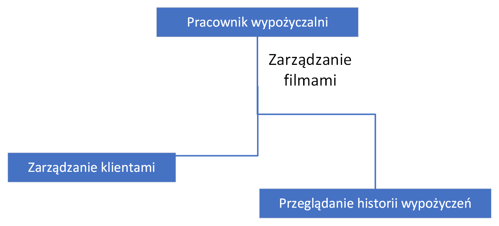

# Baza danych filmów i system rekomendacji
Autor: Michał Romaszewski

Niestety nie mogłem się porozumieć z partnerem wyznaczonym do pracy w grupie (Michał Rojek) więc projekt wykonałem samodzielnie.

### Koncepcja rozwiązania systemu ewidencji wypożyczalni filmów

#### 1. Wprowadzenie
Celem projektu jest stworzenie kompleksowego systemu baz danych, który wspomaga pracę wypożyczalni filmów. System ten będzie zarządzał informacjami o filmach, klientach, wypożyczeniach, opiniach i historii wypożyczeń. Dodatkowo zostanie wprowadzony system rekomendacji filmów na podstawie preferencji użytkowników i ich historii oglądania.

#### 2. Diagram bazy danych

#### 3. Struktura bazy danych
Baza danych będzie składała się z pięciu głównych tabel: Filmy, Klienci, Wypożyczenia, Opinie i Historia. 
Poniżej znajduje się szczegółowy opis każdej z tabel.

##### TABELA: FILMY
•	movie_id (int, PK): Unikalny identyfikator filmu.
•	title (varchar(255)): Tytuł filmu.
•	genre (varchar(50)): Gatunek filmu.
•	release_date (date): Data premiery filmu.
•	number_of_copies (int): Liczba kopii dostępnych w wypożyczalni.

##### TABELA: KLIENCI
•	client_id (int, PK): Unikalny identyfikator klienta.
•	first_name (varchar(100)): Imię klienta.
•	last_name (varchar(100)): Nazwisko klienta.
•	email (varchar(255)): Adres e-mail klienta.
•	phone_number (varchar(20)): Numer telefonu klienta.

##### TABELA: WYPOŻYCZENIA
•	rental_id (int, PK): Unikalny identyfikator wypożyczenia.
•	client_id (int, FK): Identyfikator klienta (klucz obcy, referencja do tabeli Klienci).
•	movie_id (int, FK): Identyfikator filmu (klucz obcy, referencja do tabeli Filmy).
•	rent_date (date): Data wypożyczenia.
•	return_date (date): Data zwrotu.

##### TABELA: HISTORIA
•	history_id (int, PK): Unikalny identyfikator historii.
•	client_id (int, FK): Identyfikator klienta (klucz obcy, referencja do tabeli Klienci).
•	movie_id (int, FK): Identyfikator filmu (klucz obcy, referencja do tabeli Filmy).
•	rent_date (date): Data wypożyczenia.
•	return_date (date): Data zwrotu.

##### TABELA: OPINIE
•	opinion_id (int, PK): Unikalny identyfikator opinii.
•	client_id (int, FK): Identyfikator klienta (klucz obcy, referencja do tabeli Klienci).
•	movie_id (int, FK): Identyfikator filmu (klucz obcy, referencja do tabeli Filmy).
•	rate (int): Ocena filmu (np. w skali od 1 do 10).
•	comment (text): Komentarz użytkownika dotyczący filmu.

#### 4. RELACJE MIĘDZY TABELAMI
•	Filmy i Klienci mają relacje z tabelą Wypożyczenia oraz Historia poprzez klucze obce movie_id i client_id.
•	Filmy i Klienci są również powiązane z tabelą Opinie poprzez klucze obce movie_id i client_id.
•	Tabela Wypożyczenia ma referencje do tabeli Historia w celu ewidencjonowania historii wypożyczeń.

#### 5. SYSTEM REKOMENDACJI
System rekomendacji będzie analizował historię wypożyczeń oraz oceny filmów, aby sugerować klientom filmy, które mogą ich zainteresować. Możliwe podejścia do rekomendacji obejmują:
•	Collaborative Filtering: Analiza podobieństw między użytkownikami na podstawie ich historii oglądania i ocen.
•	Content-Based Filtering: Analiza cech filmów (gatunek, obsada) i preferencji użytkowników.

#### 6. EWIDENCJA REZERWACJI
System będzie obsługiwał rezerwacje filmów poprzez wprowadzenie mechanizmu kolejek oczekujących. Użytkownicy będą mogli rezerwować filmy, a system automatycznie powiadomi ich, gdy film będzie dostępny do wypożyczenia.

### Dokumentacja przypadków użycia
#### 1. Aktorzy
- Klient: Użytkownik, który wypożycza filmy, przegląda katalog, dodaje opinie i korzysta z systemu rekomendacji.
- Pracownik Wypożyczalni: Osoba zarządzająca filmami, klientami, wypożyczeniami i rezerwacjami.
- System Rekomendacji: Automatyczny system analizujący dane i sugerujący filmy użytkownikom.

#### 2. Główne Przypadki Użycia
- Przeglądanie Katalogu Filmów
- Wypożyczenie Filmu
- Zwrot Filmu
- Dodanie Opinii o Filmie
- Rejestracja Nowego Klienta
- Logowanie Klienta
- Zarządzanie Filmami
- Zarządzanie Klientami
- Przeglądanie Historii Wypożyczeń
- Rekomendacja Filmów
- Rezerwacja Filmu

#### 3. Diagramy Use Case
- Diagram dla Klienta

- Diagram dla pracownika wypożyczalni

- Diagram dla systemu rekomendacji

#### 4. Opis Przypadków Użycia
- Przeglądanie Katalogu Filmów
Aktor: Klient
Opis: Klient przegląda dostępne filmy w katalogu, filtrując je według gatunku, roku premiery, oceny i innych kryteriów.
Scenariusz: Klient loguje się do systemu -> Wybiera opcję przeglądania katalogu -> Filtruje i sortuje filmy -> Przegląda szczegóły wybranych filmów.
 
- Wypożyczenie Filmu
Aktor: Klient
Opis: Klient wypożycza wybrany film.
Scenariusz: Klient przegląda katalog filmów -> Wybiera film -> Sprawdza dostępność -> Wypożycza film -> System zapisuje wypożyczenie.
 
- Zwrot Filmu
Aktor: Klient
Opis: Klient zwraca wcześniej wypożyczony film.
Scenariusz: Klient loguje się do systemu -> Wybiera opcję zwrotu filmu -> Potwierdza zwrot -> System aktualizuje status wypożyczenia.
 
- Dodanie Opinii o Filmie
Aktor: Klient
Opis: Klient dodaje opinię i ocenę dla filmu.
Scenariusz: Klient loguje się do systemu -> Wybiera film -> Dodaje ocenę i komentarz -> System zapisuje opinię.
 
- Rejestracja Nowego Klienta
Aktor: Klient
Opis: Nowy użytkownik rejestruje się w systemie.
Scenariusz: Nowy użytkownik wypełnia formularz rejestracyjny -> System tworzy nowy profil klienta.
 
- Logowanie Klienta
Aktor: Klient
Opis: Klient loguje się do systemu.
Scenariusz: Klient wprowadza dane logowania -> System uwierzytelnia klienta -> Klient uzyskuje dostęp do swojego konta.
 
- Zarządzanie Filmami
Aktor: Pracownik Wypożyczalni
Opis: Pracownik dodaje, edytuje lub usuwa filmy z katalogu.
Scenariusz: Pracownik loguje się do systemu -> Wybiera opcję zarządzania filmami -> Dodaje/edytuje/usunięcie film -> System aktualizuje bazę danych.
 
- Zarządzanie Klientami
Aktor: Pracownik Wypożyczalni
Opis: Pracownik zarządza informacjami o klientach.
Scenariusz: Pracownik loguje się do systemu -> Wybiera opcję zarządzania klientami -> Dodaje/edytuje/usunięcie klientów -> System aktualizuje bazę danych.
 
- Przeglądanie Historii Wypożyczeń
Aktorzy: Klient, Pracownik Wypożyczalni
Opis: Klient lub pracownik przegląda historię wypożyczeń.
Scenariusz: Klient/Pracownik loguje się do systemu -> Wybiera opcję przeglądania historii -> System wyświetla historię wypożyczeń.
 
- Rekomendacja Filmów
Aktor: Klient
Opis: System rekomenduje filmy na podstawie historii oglądania i preferencji klienta.
Scenariusz: Klient loguje się do systemu -> Wybiera opcję rekomendacji -> System analizuje dane -> Wyświetla listę rekomendowanych filmów.
 
- Rezerwacja Filmu
Aktor: Klient
Opis: Klient rezerwuje film, który jest aktualnie niedostępny.
Scenariusz: Klient loguje się do systemu -> Wybiera film -> System sprawdza dostępność -> Jeśli film jest niedostępny, klient może go zarezerwować -> System zapisuje rezerwację i powiadamia klienta, gdy film będzie dostępny.

#### 5. Definicja kluczy obcych

- Tabela: rentals
1. Klucz obcy: client_id
Referencja do: clients.client_id
Opis: Zapewnia, że każda wartość client_id w tabeli rentals odpowiada istniejącemu client_id w tabeli clients.

2. Klucz obcy: movie_id
Referencja do: movies.movie_id
Opis: Zapewnia, że każda wartość movie_id w tabeli rentals odpowiada istniejącemu movie_id w tabeli movies.

- Tabela: history
1. Klucz obcy: client_id
Referencja do: clients.client_id
Opis: Zapewnia, że każda wartość client_id w tabeli history odpowiada istniejącemu client_id w tabeli clients.

2. Klucz obcy: movie_id
Referencja do: movies.movie_id
Opis: Zapewnia, że każda wartość movie_id w tabeli history odpowiada istniejącemu movie_id w tabeli movies.

- Tabela: opinions
1. Klucz obcy: client_id
Referencja do: clients.client_id
Opis: Zapewnia, że każda wartość client_id w tabeli opinions odpowiada istniejącemu client_id w tabeli clients.
2. Klucz obcy: movie_id
Referencja do: movies.movie_id
Opis: Zapewnia, że każda wartość movie_id w tabeli opinions odpowiada istniejącemu movie_id w tabeli movies.
